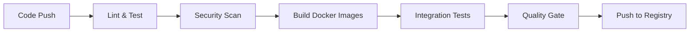
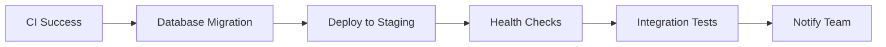
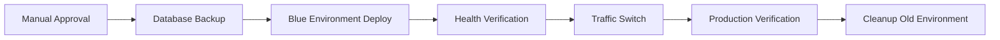

# Deployment Guide

## Overview

This guide provides step-by-step instructions for deploying the Blog Application across different environments. The deployment process uses a combination of GitHub Actions for CI/CD, Ansible for infrastructure management, and Docker for containerization.

## Table of Contents

1. [Prerequisites](#prerequisites)
2. [Environment Setup](#environment-setup)
3. [Deployment Process](#deployment-process)
4. [Post-Deployment Verification](#post-deployment-verification)
5. [Troubleshooting](#troubleshooting)
6. [Rollback Procedures](#rollback-procedures)

## Prerequisites

### Required Tools

- **Docker**: Version 20.10 or higher
- **Docker Compose**: Version 2.0 or higher
- **Ansible**: Version 6.0 or higher
- **Git**: Version 2.30 or higher
- **Node.js**: Version 20.x (for local development)

### Access Requirements

- **GitHub Repository**: Read access for code, write access for CI/CD
- **Container Registry**: Push/pull access to GitHub Container Registry
- **Server Access**: SSH access to target servers
- **Secrets Management**: Access to GitHub Secrets and Ansible Vault

### Infrastructure Requirements

#### Development Environment
- **Minimum**: 4GB RAM, 2 CPU cores, 20GB disk space
- **Recommended**: 8GB RAM, 4 CPU cores, 50GB disk space
- **OS**: Ubuntu 20.04 LTS or higher

#### Staging Environment
- **Application Server**: 8GB RAM, 4 CPU cores, 100GB disk space
- **Database Server**: 16GB RAM, 4 CPU cores, 200GB disk space
- **Load Balancer**: 4GB RAM, 2 CPU cores, 50GB disk space

#### Production Environment
- **Application Servers** (3x): 16GB RAM, 8 CPU cores, 200GB disk space
- **Database Servers** (3x): 32GB RAM, 8 CPU cores, 500GB disk space
- **Load Balancers** (2x): 8GB RAM, 4 CPU cores, 100GB disk space
- **Cache Servers** (3x): 16GB RAM, 4 CPU cores, 100GB disk space

## Environment Setup

### 1. Development Environment

#### Using Docker Compose (Recommended)

```bash
# Clone the repository
git clone https://github.com/mprabesh/blog-app.git
cd blog-app

# Copy environment template
cp .env.example .env

# Edit environment variables
nano .env

# Start development environment
docker-compose -f docker/development/docker-compose.dev.yml up -d

# Verify deployment
curl http://localhost:3001
curl http://localhost:8081/api/ping
```

#### Local Development Setup

```bash
# Backend setup
cd blog-list
npm install
cp .env.example .env
# Edit .env with local MongoDB and Redis URLs
npm run start:dev

# Frontend setup (in new terminal)
cd bloglist-frontend
npm install
cp .env.frontend.example .env.local
# Edit .env.local with backend API URL
npm run dev
```

### 2. Staging Environment

#### Ansible Deployment

```bash
# Install Ansible
pip install ansible

# Configure inventory
cp ansible/inventory/staging.example ansible/inventory/staging
# Edit staging inventory with actual server IPs

# Set up SSH keys
ssh-copy-id -i ~/.ssh/blog-app-staging deploy@staging-server

# Deploy infrastructure
ansible-playbook -i ansible/inventory/staging ansible/playbooks/provision.yml

# Deploy application
ansible-playbook -i ansible/inventory/staging ansible/playbooks/deploy-app.yml \
  -e app_version=staging \
  -e docker_registry_username=${{ secrets.GHCR_USERNAME }} \
  -e docker_registry_password=${{ secrets.GHCR_TOKEN }}
```

#### Manual Docker Deployment

```bash
# On staging server
sudo docker login ghcr.io -u USERNAME -p TOKEN

# Pull images
sudo docker pull ghcr.io/mprabesh/blog-app-blog-backend:staging
sudo docker pull ghcr.io/mprabesh/blog-app-blog-frontend:staging

# Start services
sudo docker-compose -f docker-compose.staging.yml up -d
```

### 3. Production Environment

#### Prerequisites Checklist

- [ ] SSL certificates installed and configured
- [ ] DNS records pointing to load balancers
- [ ] Database backups configured
- [ ] Monitoring and alerting set up
- [ ] Secrets management configured
- [ ] Network security groups configured
- [ ] Firewall rules applied

#### Blue-Green Deployment Process

```bash
# Step 1: Prepare new environment (Blue/Green)
ansible-playbook -i ansible/inventory/production ansible/site.yml \
  -e app_version=v1.2.0 \
  -e deployment_environment=blue \
  -e backup_before_deployment=true

# Step 2: Run health checks
ansible-playbook -i ansible/inventory/production ansible/playbooks/health-check.yml \
  -e target_environment=blue

# Step 3: Switch traffic (manual approval required)
ansible-playbook -i ansible/inventory/production ansible/playbooks/traffic-switch.yml \
  -e from_environment=green \
  -e to_environment=blue

# Step 4: Verify production deployment
ansible-playbook -i ansible/inventory/production ansible/playbooks/verify-deployment.yml
```

## Deployment Process

### GitHub Actions CI/CD Pipeline

The deployment process is automated through GitHub Actions workflows:

#### 1. Continuous Integration (CI)

Triggered on: Push to main/develop branches, Pull requests



#### 2. Staging Deployment

Triggered on: Successful CI completion on main branch



#### 3. Production Deployment

Triggered on: Manual approval after staging success



### Manual Deployment Steps

#### Step 1: Pre-deployment Preparation

```bash
# 1. Verify prerequisites
./scripts/verify-prerequisites.sh

# 2. Backup current deployment
./scripts/backup-deployment.sh --environment production

# 3. Check resource availability
./scripts/check-resources.sh --environment production
```

#### Step 2: Infrastructure Deployment

```bash
# 1. Update infrastructure
ansible-playbook -i ansible/inventory/production ansible/playbooks/provision.yml

# 2. Verify infrastructure health
ansible-playbook -i ansible/inventory/production ansible/playbooks/infrastructure-health.yml
```

#### Step 3: Application Deployment

```bash
# 1. Deploy application
ansible-playbook -i ansible/inventory/production ansible/playbooks/deploy-app.yml \
  -e app_version=$VERSION \
  -e deployment_strategy=blue-green

# 2. Run database migrations
ansible-playbook -i ansible/inventory/production ansible/playbooks/database-migration.yml \
  -e migration_action=migrate
```

#### Step 4: Verification and Monitoring

```bash
# 1. Health checks
./scripts/health-check.sh --environment production --comprehensive

# 2. Performance tests
./scripts/performance-test.sh --environment production

# 3. Security verification
./scripts/security-check.sh --environment production
```

## Post-Deployment Verification

### 1. Service Health Checks

```bash
# Check all services
curl -f https://blog-app.example.com
curl -f https://api.blog-app.example.com/api/ping

# Check database connectivity
curl -f https://api.blog-app.example.com/api/users

# Check cache functionality
curl -f https://api.blog-app.example.com/api/blogs
```

### 2. Performance Verification

```bash
# Load testing
./scripts/load-test.sh --duration 300 --users 100

# Response time monitoring
./scripts/response-time-check.sh --threshold 2000ms

# Database performance
./scripts/db-performance-check.sh
```

### 3. Security Verification

```bash
# SSL certificate check
./scripts/ssl-check.sh --domain blog-app.example.com

# Security headers verification
./scripts/security-headers-check.sh

# Vulnerability scan
./scripts/vulnerability-scan.sh --target production
```

### 4. Monitoring Setup Verification

```bash
# Check Prometheus metrics
curl -f https://prometheus.blog-app.example.com/api/v1/query?query=up

# Verify Grafana dashboards
curl -f https://grafana.blog-app.example.com/api/health

# Test alerting
./scripts/test-alerts.sh
```

## Troubleshooting

### Common Issues and Solutions

#### 1. Container Startup Issues

**Issue**: Containers fail to start
```bash
# Check container logs
docker-compose logs [service-name]

# Check resource availability
docker system df
docker system prune

# Verify environment variables
docker-compose config
```

#### 2. Database Connection Issues

**Issue**: Application cannot connect to database
```bash
# Check MongoDB status
docker exec -it mongodb-container mongosh --eval "db.runCommand('ping')"

# Verify connection string
echo $MONGO_URL

# Check network connectivity
docker network ls
docker network inspect blog-app-network
```

#### 3. SSL Certificate Issues

**Issue**: SSL certificate errors
```bash
# Check certificate expiry
openssl x509 -in /etc/ssl/certs/blog-app.crt -text -noout

# Verify certificate chain
openssl verify -CAfile /etc/ssl/certs/ca-certificates.crt /etc/ssl/certs/blog-app.crt

# Renew Let's Encrypt certificate
certbot renew --dry-run
```

#### 4. Performance Issues

**Issue**: Slow response times
```bash
# Check system resources
htop
iotop
iftop

# Monitor database performance
db.currentOp()
db.serverStatus()

# Check cache hit ratio
redis-cli info stats
```

### Log Analysis

#### Application Logs
```bash
# Backend logs
docker-compose logs backend | grep ERROR

# Frontend logs
docker-compose logs frontend | grep ERROR

# Database logs
docker-compose logs database | grep ERROR
```

#### System Logs
```bash
# System errors
journalctl -u docker.service -f

# Disk space issues
df -h
du -sh /var/lib/docker/

# Memory issues
free -h
cat /proc/meminfo
```

## Rollback Procedures

### Automatic Rollback

The CI/CD pipeline includes automatic rollback capabilities:

1. **Health Check Failure**: Automatically rolls back if health checks fail
2. **Performance Degradation**: Rolls back if response times exceed thresholds
3. **Error Rate Spike**: Rolls back if error rates exceed defined limits

### Manual Rollback

#### Quick Rollback (Blue-Green)

```bash
# Switch traffic back to previous environment
ansible-playbook -i ansible/inventory/production ansible/playbooks/traffic-switch.yml \
  -e from_environment=blue \
  -e to_environment=green \
  -e rollback=true
```

#### Full Rollback

```bash
# Step 1: Stop new deployment
docker-compose -f docker-compose.prod.yml down

# Step 2: Restore from backup
./scripts/restore-deployment.sh --backup-id BACKUP_ID

# Step 3: Start previous version
docker-compose -f docker-compose.prod.yml up -d

# Step 4: Verify rollback
./scripts/health-check.sh --environment production
```

#### Database Rollback

```bash
# Restore database from backup
ansible-playbook -i ansible/inventory/production ansible/playbooks/database-migration.yml \
  -e migration_action=rollback \
  -e rollback_steps=1

# Verify data integrity
./scripts/data-integrity-check.sh
```

### Post-Rollback Actions

1. **Incident Documentation**: Document the issue and rollback reasons
2. **Root Cause Analysis**: Investigate and fix the underlying issue
3. **Testing**: Thoroughly test the fix in staging environment
4. **Communication**: Notify stakeholders about the rollback and next steps

---

*This guide is regularly updated with new procedures and best practices. For questions or issues, contact the DevOps team.*